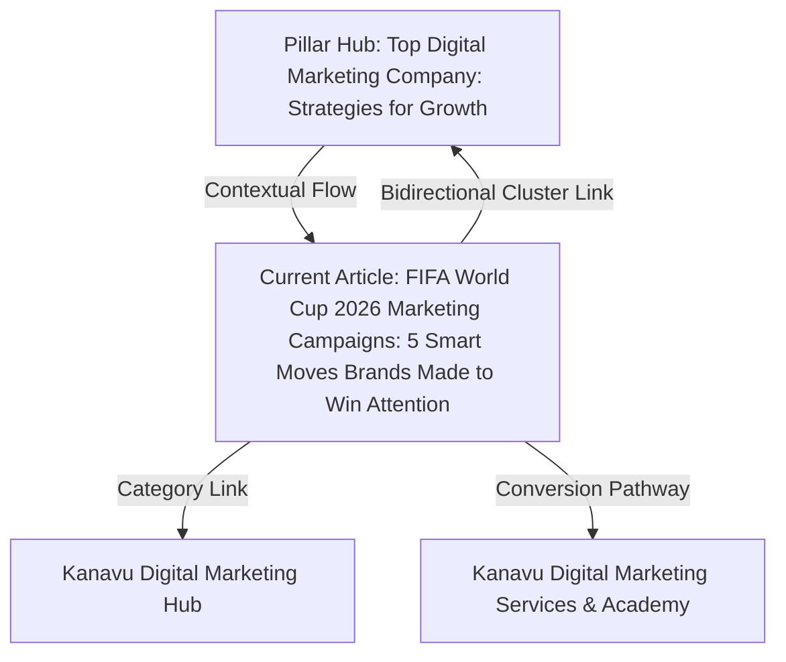

# Topic Cluster Architecture: FIFA World Cup 2026 Marketing Campaigns: 5 Smart Moves Brands Made to Win Attention

```mermaid
graph TD
    Pillar["Pillar Hub: Top Digital Marketing Company: Strategies for Growth"]
    Current["Current Article: FIFA World Cup 2026 Marketing Campaigns: 5 Smart Moves Brands Made to Win Attention"]
    Hub["Kanavu Digital Marketing Hub"]
    Service["Kanavu Digital Marketing Services & Academy"]

    Pillar -->|Contextual Flow| Current
    Current -->|Bidirectional Cluster Link| Pillar
    Current -->|Category Link| Hub
    Current -->|Conversion Pathway| Service
```
